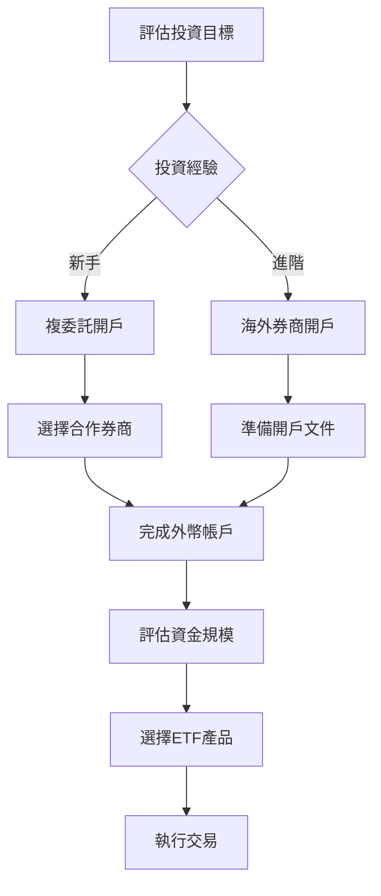

# 台灣投資者如何購買比特幣 ETF？

## 比特幣 ETF 的投資優勢
比特幣 ETF（交易所交易基金）作為金融創新型產品，讓投資者能像買賣股票般參與加密市場。這種金融工具透過追蹤比特幣價格表現，為投資者提供三大核心優勢：
1. **技術門檻降低**：無需管理加密錢包與私鑰
2. **風險分散機制**：專業機構管理資產配置
3. **監管透明化**：受證券法規約束的投資管道

👉 [了解比特幣最新市場行情](https://bit.ly/okx_welcome)

## 比特幣 ETF 類型解析
### 現貨比特幣 ETF
- **資產結構**：直接持有實體比特幣
- **價格機制**：與市場現貨價格1:1掛鉤
- **監管挑戰**：需通過美國SEC審核（2024年已通過6檔產品）
- **典型代表**：貝萊德IBIT、富達FBTC

### 期貨比特幣 ETF
- **操作模式**：通過比特幣期貨合約追蹤價格
- **成本考量**：存在合約滾動成本與基差風險
- **市場優勢**：更容易獲得監管機構批准
- **代表產品**：ProShares BITO、ARK Invest ARKB

| ETF類型       | 價格波動性 | 監管難度 | 成本效益比 |
|---------------|------------|----------|------------|
| 現貨ETF       | ★★★★☆      | ★★★★★    | ★★★★☆      |
| 期貨ETF       | ★★★☆☆      | ★★★☆☆    | ★★★☆☆      |

## 台灣投資管道全解析
截至2025年Q2，台灣尚未推出本土比特幣ETF，但金管會已開放專業投資人通過以下兩大管道參與：

### 途徑一：複委託開戶（新手首選）
**操作流程：**
1. 選定合作券商（元大、富邦等12家已取得執照）
2. 完成外幣帳戶開立（手續費NT$150）
3. 進行美元換匯（匯差約0.3-0.5%）
4. 通過券商平台交易（交易代碼如IBIT）

**費用結構：**
- 券商佣金：0.05%-0.2%（最低USD$2）
- 平台使用費：NT$100/筆
- 匯率損失：約0.3-0.5%

👉 [比較各券商費用結構](https://bit.ly/okx_welcome)

**常見問題解答**
Q：複委託交易是否需要證券專業投資人資格？
A：根據金管會規定，單筆交易金額低於USD$5,000者無需專業資格認證。

Q：資金結算需要多少工作天？
A：T+2結算制度，資金最快3個營業日到帳。

### 途徑二：海外券商開戶（進階選擇）
**熱門平台比較：**
| 平台名稱         | 開戶門檻 | 交易費用 | 中文支援 |
|------------------|----------|----------|----------|
| Interactive Brokers | USD$0    | 0.005%起 | ★★★☆☆    |
| Firstrade        | USD$0    | 零佣金    | ★★☆☆☆    |
| Webull           | USD$0    | 零佣金    | ★★★★☆    |

**操作要點：**
- 身分驗證需提供雙證件（護照+地址證明）
- 資金電匯約需3-5個工作天
- 平台介面建議選擇英文模式

## 熱門ETF產品分析
### 市場規模前五名
| ETF名稱                    | 管理資產(億美元) | 年化管理費率 | 成立日期     |
|---------------------------|------------------|--------------|--------------|
| iShares Bitcoin Trust(IBIT) | 225.6            | 0.25%        | 2024/01/11   |
| Grayscale Bitcoin Trust(GBTC)| 157.4            | 1.50%        | 2013/09/23   |
| Fidelity Bitcoin Fund(FBTC) | 108.8            | 0.30%        | 2024/03/20   |
| ARK Invest Bitcoin ETF(ARKB) | 32.3             | 0.25%        | 2024/01/15   |
| Bitwise Bitcoin ETF(BITB)   | 24.2             | 0.20%        | 2024/03/05   |

### 投資決策關鍵指標
1. **資產規模（AUM）**：建議選擇前十大ETF（流動性保障）
2. **折溢價幅度**：GBTC長期存在3-5%折價需特別注意
3. **稅務處理**：海外ETF需主動申報海外所得

## 風險管理與資產配置
### 建議投資比例
- **保守型**：不超過總資產5%
- **平衡型**：建議配置5-10%
- **積極型**：最高不超過15%

### 波動率監測指標
- 30日歷史波動率超過40%時建議減倉
- 當BTC/ETF價差超過2%時存在套利機會

👉 [即時監測ETF市場數據](https://bit.ly/okx_welcome)

## 常見問題解答
Q：台灣投資人購買海外ETF需要申報嗎？
A：根據財政部規定，海外金融資產達USD$500萬需主動申報，但投資收益需列入綜合所得稅。

Q：比特幣ETF與虛擬貨幣現貨有何差異？
A：ETF提供證券化交易管道，避免私鑰管理風險，但缺乏區塊鏈投票權等權益。

Q：如何選擇現貨與期貨ETF？
A：長期持有建議選擇現貨型，短期操作可考慮期貨型（注意滾動成本）。

Q：台灣券商支援哪些比特幣ETF？
A：目前主要支援IBIT、GBTC、BITO等8檔產品，建議開戶前與營業員確認。

Q：電匯資金是否需要報稅？
A：資金移轉本身不計稅，但投資損益需在次年5月申報綜合所得。

## 投資決策流程圖

## 未來市場展望
根據投信投研中心預測，台灣比特幣ETF市場將在2026年迎來爆發成長：
- 2025年市場規模預估：NT$120億
- 2026年成長預測：年增率85%
- 產品創新方向：槓桿型ETF、跨鏈ETF

隨著金管會逐步放寬監管，預期2025年底前將有3-5家本土機構提出ETF申請。投資者應持續關注政策動態，同時通過專業投顧服務進行資產配置優化。