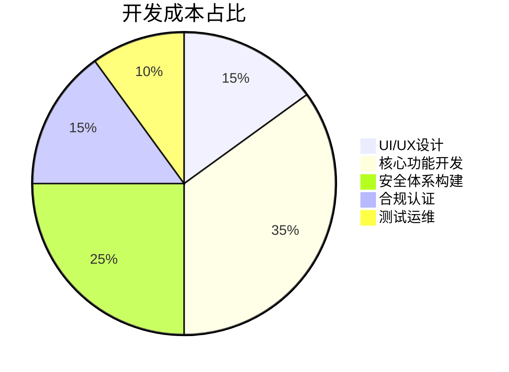

# 如何创建加密货币钱包应用：2025年分步指南

在数字经济蓬勃发展的当下，加密货币钱包开发正迎来黄金机遇。根据市场研究数据，全球加密钱包市场规模预计从2023年的84.2亿美元增长至2032年的772.1亿美元，年复合增长率达24.8%。本文将系统解析2025年开发加密货币钱包的全流程，助您把握Web3时代的商业机遇。

## 加密货币钱包的核心价值

加密货币钱包作为数字资产的管理门户，其核心功能是存储、发送和接收加密货币。与传统钱包不同，它通过存储私钥实现对数字资产的控制权。私钥作为加密算法生成的唯一凭证，是验证交易和保障资产安全的关键。

> **核心洞察**：钱包本质是区块链网络的交互接口，通过验证用户余额和数字签名完成交易授权，这种去中心化特性重塑了数字资产所有权概念。

## 钱包类型深度解析

### 存储方式分类
| 类型       | 特点                          | 安全性 | 适用场景             |
|------------|-----------------------------|--------|--------------------|
| 热钱包     | 在线存储，实时交易          | 中等   | 日常小额交易       |
| 冷钱包     | 离线存储，物理设备保护      | 高     | 长期大额资产存储   |

### 管理模式对比
- **托管钱包**：第三方保管私钥，适合新手用户，但存在中心化风险
- **非托管钱包**：用户自主掌控私钥，符合去中心化理念，需具备基础安全知识

## 2025年开发黄金时机

### 五大核心驱动力
1. **主流金融融合**：全球主要金融机构加速布局数字资产，Visa、PayPal等支付巨头已开放加密货币交易
2. **Web3生态爆发**：DeFi锁仓量突破1000亿美元，NFT交易额年增300%，钱包成为生态入口
3. **安全需求升级**：2024年加密货币诈骗损失超45亿美元，推动安全钱包需求激增
4. **合规化转型**：全球62个国家建立加密货币监管框架，合规钱包开发窗口期显现
5. **技术创新红利**：零知识证明、多方计算等前沿技术降低开发门槛

👉 [立即体验顶级加密钱包服务](https://bit.ly/okx_welcome)

## 开发全流程指南

### 第一步：确定产品定位
- **市场趋势**：非托管钱包市场份额从2020年的35%提升至2024年的68%
- **技术选型**：多链支持成为标配，建议优先集成以太坊、比特币、Solana等主流链
- **用户画像**：机构投资者倾向硬件钱包，普通用户偏好移动端+Web3浏览器集成

### 第二步：技术架构设计
**前端开发栈**：
- 移动端：React Native（跨平台兼容）
- 桌面端：Electron（支持Windows/Mac/Linux）
- 浏览器扩展：Chrome/Firefox SDK

**后端关键技术**：
- 区块链交互：Web3.js/Ethers.js（以太坊生态）、Bitcoin Core API
- 安全架构：HSM（硬件安全模块）、MPC（多方计算）
- 数据存储：IPFS（分布式存储）、PostgreSQL（交易记录）

### 第三步：开发模式选择
| 模式          | 优点                      | 缺点                      | 适用场景           |
|---------------|-------------------------|-------------------------|------------------|
| 原生开发      | 完全定制化，技术可控      | 开发周期长（6-12个月）    | 大型企业/创新产品 |
| 白标解决方案  | 快速部署（4-8周）         | 功能扩展性受限            | 初创企业/试点项目 |

👉 [获取专业开发方案](https://bit.ly/okx_welcome)

### 第四步：核心功能实现
1. **密钥管理系统**
   - BIP32/BIP44分层结构设计
   - 生词组备份（12/24词标准）
   - 硬件安全模块(HSM)集成

2. **交易引擎**
   - 多链交易签名适配
   - Gas费智能优化算法
   - 跨链桥接协议集成

3. **DeFi整合**
   - DApp浏览器嵌套
   - 质押收益聚合器
   - NFT展示与交易模块

### 第五步：安全体系构建
- **传输层**：TLS 1.3加密通信
- **存储层**：AES-256加密私钥文件
- **认证层**：生物识别+多因素认证
- **监测层**：异常交易行为AI检测
- **灾备层**：分布式密钥分片存储

### 第六步：用户体验优化
- **交互设计**：
  - 零知识证明实现隐私交易
  - 语音助手指令系统
  - AR资产可视化展示
- **性能指标**：
  - 首次同步时间＜3分钟
  - 交易确认延迟＜5秒
  - 离线交易成功率100%

## 2025必备创新功能

### 多维功能矩阵
| 功能类别       | 核心价值点                  | 技术实现                 |
|----------------|---------------------------|------------------------|
| 法币通道       | 信用卡即时兑换              | 与MoonPay等服务商集成    |
| 智能合约交互   | 可视化合约调用界面          | ABI解析器+交易模拟器     |
| 隐私增强       | 混币服务/匿名交易         | CoinJoin/ZK-SNARKs技术   |
| 跨链枢纽       | 原生资产跨链转移            | 轻节点验证+预言机网络    |
| 社交功能       | 加密消息+社群打赏           | 端到端加密通信协议       |

### 支付网关整合方案
通过集成Stripe Crypto或Ripple支付协议，实现：
- 法币-加密货币即时兑换
- 商户端自动对账系统
- 多币种结算门户
- 反洗钱(AML)合规引擎

## 开发成本分析

### 成本构成模型

### 预算区间参考
- 基础版（单链+托管）：$50,000-$120,000
- 专业版（多链+非托管）：$150,000-$300,000
- 旗舰版（DeFi+跨链+隐私）：$500,000+

## FAQ精选

**Q1：如何选择适配的区块链网络？**
A：建议优先支持EVM兼容链（以太坊/BNB Chain）和比特币网络，后续扩展Solana、Cosmos等高性能链。注意不同链的共识机制差异（PoW/PoS）和智能合约兼容性。

**Q2：冷热钱包如何科学配比？**
A：建议采用"金字塔结构"：95%资产冷存储（硬件钱包+多重签名），4%热钱包用于流动性，1%作为零钱池。定期进行压力测试和灾难恢复演练。

**Q3：合规化开发需要注意哪些关键点？**
A：重点完成：KYC/AML系统对接、OFAC制裁名单筛查、交易可疑行为监测、司法辖区白名单管理。建议聘请区块链法律顾问团队。

👉 [获取合规解决方案](https://bit.ly/okx_welcome)

## 未来趋势前瞻

2025年加密钱包将呈现三大进化方向：
1. **智能代理化**：集成AI资产管理助手，实现自动化的跨链套利和风险对冲
2. **生物特征化**：虹膜识别+脑波验证的多模态认证体系
3. **社交金融化**：基于零知识证明的匿名社交投资组合

随着欧盟MiCA法案和美国SEC监管框架的落地，合规化开发已成为行业标配。建议开发者提前布局隐私计算、合规DeFi等前沿领域，在技术创新与监管适应间找到平衡点。

> **行动建议**：立即启动MVP（最小可行性产品）开发，重点验证跨链交易和合规KYC模块，利用敏捷开发模式快速迭代。