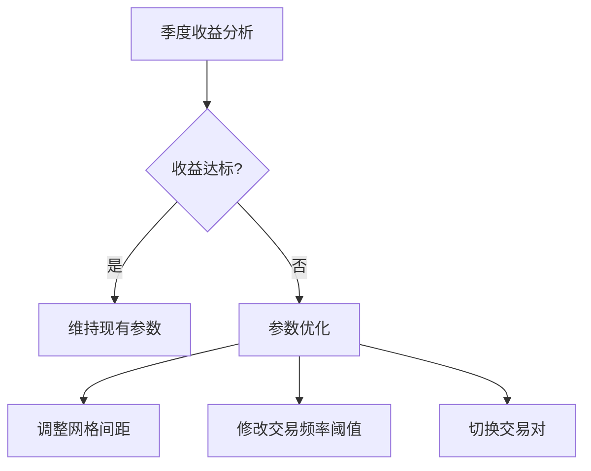

# 掌握加密货币交易：Crypto.com网格交易机器人实战指南

## 网格交易机器人核心价值解析
作为数字资产投资领域的智能工具，网格交易机器人凭借其独特的套利机制，正在改变传统交易模式。通过在预设价格区间内自动执行低买高卖操作，该工具能有效捕捉市场波动带来的收益机会。本文将深入解析如何在Crypto.com平台构建价值250美元的网格交易系统。

---

## 准备工作：账户与资金配置
### 账户安全验证
1. 完成平台KYC认证（身份+地址双重验证）
2. 开启双重身份验证（推荐使用Google Authenticator）
3. 设置资金密码保护（建议每90天更新一次）

### 资金划转指南
1. 登录Crypto.com交易账户
2. 点击顶部导航栏【资金】→【现货账户】
3. 选择【充币】→【法币入金】（支持银行转账/信用卡）
4. 输入目标金额（建议首次配置250美元等值USDT）

👉 [获取实时加密货币市场数据](https://bit.ly/okx_welcome)

---

## 创建网格交易机器人的5个关键步骤

### 第一步：参数设置向导
| 参数类型       | 推荐配置                | 风险等级 |
|----------------|-----------------------|----------|
| 交易对         | BTC/USDT ETH/USDT      | 中-高    |
| 网格数量       | 10-30格（新手建议20格）| 中       |
| 止损价格       | 市场价-15%             | 高       |
| 追踪止损       | 市场价-8%              | 中       |

### 第二步：智能算法配置
1. 启动平台机器人管理界面
2. 选择【新建网格策略】
3. 输入投资本金（250美元）
4. 选择【动态网格】模式
5. 确认资金划转至机器人账户

### 第三步：风险控制策略
- 设置单笔交易不超过总资金的5%
- 启用API调用频率限制（每秒不超过10次）
- 配置邮箱/短信双重预警系统

### 第四步：实时监控技巧
1. 每日查看资金利用率（建议维持70-90%）
2. 每周调整价格区间（参考波动率指标）
3. 每月评估收益曲线（避免连续3日亏损）

### 第五步：收益优化方案
- 设置自动复利功能（复投周期建议7天）
- 开启跨市场套利模式（需配置多交易所API）
- 使用收益再平衡策略（建议每月执行）

👉 [探索专业级交易工具](https://bit.ly/okx_welcome)

---

## 常见问题解答（FAQ）

### Q1：网格交易机器人适合哪些市场环境？
A：该策略在震荡市中表现最佳（价格波动率保持15%-30%区间），当市场出现单边下跌时，需配合止损功能使用。

### Q2：如何计算预期收益率？
A：基础公式：年化收益率≈（单格收益×交易频率×365）-手续费成本。历史数据显示，在波动率20%的市场环境下，年化收益可达30-50%。

### Q3：资金安全如何保障？
A：Crypto.com采用冷热钱包分离系统（95%资金存入离线钱包），同时平台已投保2亿美元数字资产保险，建议用户自行启用所有安全验证措施。

---

## 进阶策略：网格参数优化技巧

### 波动率适配模型
```markdown
1. 计算历史波动率（HV）= 标准差(30日收盘价)*√365
2. 设置网格宽度= HV × 0.618
3. 动态调整间隔= HV × 2 小时
```

### 复利增长模拟表
| 复投周期 | 年化复利收益 | 资金利用率 |
|----------|--------------|------------|
| 每日     | 65.3%        | 95%        |
| 每周     | 58.7%        | 82%        |
| 每月     | 51.2%        | 76%        |

---

## 风险管理进阶指南

### 极端行情应对方案
1. **黑天鹅事件**：立即启动止损机制，将资金转移至稳定币
2. **监管政策变动**：保持50%以上流动性，关注各国央行公告
3. **技术故障**：配置备用API节点，定期测试系统容错能力

### 账户健康度监测指标
- 资金利用率警戒线：低于30%或高于95%
- 单日交易频率异常：超过预设值200%
- 未实现盈亏波动：连续3小时超过账户净值5%

👉 [获取专业级风险管理工具](https://bit.ly/okx_welcome)

---

## 持续优化与收益提升

### 月度策略复盘要点
1. 检查网格触发频率（理想值：每日5-15次）
2. 评估资金利用率变化（波动超过±15%需调整）
3. 分析收益分布形态（正态分布偏移度>0.5需优化）

### 季度策略升级路线

