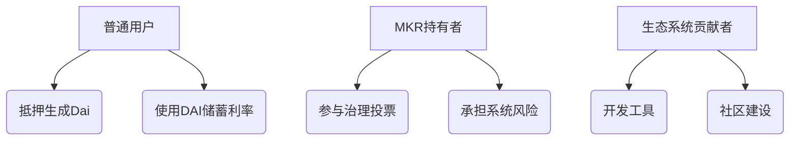

# 深度解析MakerDAO：运作机制与核心功能

## 一、去中心化金融新范式：什么是MakerDAO？

在区块链技术驱动的金融创新浪潮中，MakerDAO凭借其独特的"加密央行"架构脱颖而出。作为以太坊生态中最成熟的去中心化金融协议之一，它通过Dai稳定币构建起连接加密世界与传统金融的桥梁。

### 1.1 核心架构解析
MakerDAO的双层架构设计具有显著的创新性：
- **资产层**：通过智能合约管理抵押资产
- **治理层**：由MKR代币持有者集体决策

这种架构打破了传统央行的封闭决策模式，将货币政策制定权下放至全球参与者。用户通过质押ETH等资产生成Dai，同时MKR代币持有者通过投票决定利率、抵押率等关键参数。

### 1.2 创新性突破
与传统金融体系相比，MakerDAO实现了三大革新：
| 维度        | 传统央行          | MakerDAO        |
|-------------|-------------------|-----------------|
| 决策机制    | 中心化委员会       | 去中心化投票     |
| 货币发行    | 法定货币增发       | 超额抵押生成     |
| 透明度      | 黑箱操作           | 链上可查         |

> 👉 [了解更多加密金融创新模式](https://bit.ly/okx_welcome)

## 二、Dai稳定币：算法稳定的实践者

作为加密世界最具代表性的稳定币之一，Dai通过多维度机制维持其价值锚定。其运作原理可概括为"超额抵押+动态调节"的双轮驱动模式。

### 2.1 抵押生成机制
用户通过创建抵押债务头寸（CDP）生成Dai：
1. 将ETH等资产存入智能合约
2. 按照150%的最低抵押率生成Dai
3. 支付稳定费维持债务状态

**典型操作示例：**
- 抵押价值：$3,000 ETH
- 可生成Dai：≤$2,000（抵押率≥150%）
- 稳定费：根据投票确定的利率计算

### 2.2 风险控制系统
当抵押资产价值下跌触发清算：
- 自动启动拍卖程序
- 由Keeper机器人执行清算
- 优先使用Maker缓冲池补偿损失
- 必要时增发MKR代币填补缺口

> 👉 [探索更多稳定币机制](https://bit.ly/okx_welcome)

## 三、治理生态：代币持有者的权力游戏

MKR代币不仅是治理工具，更是系统风险的最终承担者。其治理体系包含三大核心职能：

### 3.1 治理权限矩阵
| 权限类型        | 具体内容                   |
|-----------------|---------------------------|
| 资产准入        | 决定可接受的抵押资产类型    |
| 风险参数调整    | 设定抵押率、债务上限等参数  |
| 系统升级        | 投票通过协议重大改进提案    |

### 3.2 激励相容机制
- 抵押者：通过生成Dai获取流动性
- 储户：享受DAI储蓄利率（DSR）
- 治理者：通过参与决策获取系统收益

## 四、风险全景：机遇与挑战并存

### 4.1 主要风险源分析
1. **价格波动风险**：极端行情下的清算压力
2. **中心化依赖**：USDC等中心化资产占比过高
3. **预言机风险**：价格喂养延迟导致的清算偏差
4. **治理攻击**：MKR代币集中度引发的投票权倾斜

### 4.2 风险缓释措施
- 动态调整抵押率
- 多重预言机冗余
- 紧急关停机制
- 渐进式资产去中心化

> 👉 [获取区块链安全指南](https://bit.ly/okx_welcome)

## 五、参与路径：从用户到治理者

### 5.1 参与角色全景图

### 5.2 进阶参与指南
1. **抵押者**：需关注抵押率与稳定费变动
2. **治理者**：建议持有MKR参与关键投票
3. **开发者**：可构建Dai应用场景的DApp

## 六、FAQ：常见问题解答

**Q：Dai与USDT等稳定币的本质区别？**
A：Dai采用超额抵押机制，完全由链上资产担保，且治理权开放给所有参与者。

**Q：如何计算抵押生成Dai的利息成本？**
A：稳定费=债务金额×年利率÷365×实际天数，利率由治理投票决定。

**Q：系统发生资不抵债时如何处理？**
A：首先动用Maker缓冲池资金，不足部分通过拍卖MKR代币补足。

**Q：MKR代币的最大风险是什么？**
A：当系统出现巨额赤字时，可能触发代币增发稀释持有者权益。

## 七、未来展望：构建开放金融基础设施

随着DeFi生态的演进，MakerDAO正在向多链部署和现实资产上链方向拓展。通过引入真实世界资产（RWA）和跨链互操作性，其有望成为连接链下金融与加密经济的枢纽。

在监管环境日益明确的当下，如何平衡去中心化特性与合规要求，将成为决定其未来发展的关键命题。但不可否认的是，这套由代码构建的"加密央行"系统，已经为金融基础设施创新提供了重要范本。